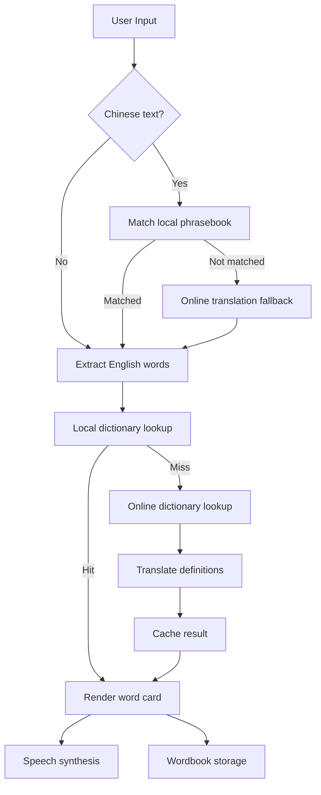

# Lucia's Dictionary

面向中文家庭儿童的英语句子拆词学习工具。输入老师布置的中文或英文句子后，应用会把英文句子拆成单词卡，提供中文释义、音标、朗读、整句跟读、生词收藏和课堂常用句学习流程。

这个项目来自一个真实家庭学习场景：Lucia 在美国小学学习时，经常会遇到老师布置的英文作业句子。问题不只是“不认识某个单词”，而是孩子需要快速知道整句话里每个词的意思、怎么读、哪些词需要以后复习。Lucia's Dictionary 的目标是把这件事变成一个低摩擦、儿童友好的学习闭环。

## User Flow

1. **输入句子**：家长或孩子粘贴老师布置的中文或英文句子，例如阅读、作业、数学或课堂指令。
2. **识别英文内容**：如果输入是中文，应用会优先匹配本地课堂短句；没有命中时再尝试在线翻译为英文。
3. **生成单词卡**：应用提取句子中的英文单词，去重后生成卡片，展示释义、音标、收藏按钮和朗读按钮。
4. **跟读和复习**：孩子可以点单词听多遍发音，也可以朗读整句并跟随高亮理解句子结构。
5. **收藏生词**：不熟悉的单词可以加入生词本，后续集中朗读和复习。
6. **学习常用句**：在课堂常用句模块中，孩子可以直接学习美国小学常见作业、阅读、写作、数学、科学和课堂行为指令。

## Problem

Lucia 遇到的核心学习问题有三个：

- 老师给出的作业指令常常是一整句英文，孩子不一定知道该从哪里开始理解。
- 单独查词太慢，且释义不一定适合低年级儿童。
- 临时查过的生词很容易忘，需要能收藏、反复朗读和复习。

因此这个项目没有做成传统词典搜索框，而是围绕“句子”设计：先理解完整作业句，再把句子拆成可学习、可朗读、可收藏的单词卡。

## Features

- **英文句子拆词**：从输入句子中提取英文单词，去重后生成学习卡片。
- **中文句子识别**：中文输入会优先匹配本地课堂短句，再尝试在线翻译为英文。
- **本地词库优先**：内置约 8,600 个常用英语词条，优先走本地释义，减少网络依赖。
- **在线释义兜底**：本地词库未命中时，调用公开英文词典数据并翻译为中文释义。
- **音标显示**：结合本地音标数据和在线词典结果补充发音信息。
- **单词朗读**：基于浏览器 SpeechSynthesis API，支持单词重复朗读。
- **整句朗读与高亮**：朗读句子时同步高亮当前单词卡，帮助孩子建立听读对应关系。
- **生词本**：收藏不熟悉的单词，保存在浏览器 localStorage 中，可集中复习。
- **课堂常用句**：内置美国小学常见作业、阅读、写作、数学、科学和课堂行为指令。
- **学习设置**：支持朗读速度、朗读次数和查询缓存清理。
- **移动端体验**：底部导航、卡片布局、按钮尺寸和安全区适配面向手机使用场景优化。

## Tech Architecture



### Stack

- **Framework**: Astro static site
- **Language**: JavaScript, Astro, CSS
- **Data**: JSON assets in `public/assets`
- **Storage**: `localStorage` for wordbook, settings and cache
- **Speech**: Browser `SpeechSynthesisUtterance`
- **Dictionary fallback**: `dictionaryapi.dev`
- **Translation fallback**: Google Translate public endpoint and browser Translator API when available
- **Build**: Vite through Astro

### Key Files

- `src/pages/index.astro`: application shell and page structure
- `src/scripts/app.js`: dictionary lookup, translation fallback, cache, speech, wordbook and UI interactions
- `src/styles/global.css`: mobile-first visual system and responsive layout
- `public/assets/dict.json`: local dictionary data
- `public/assets/phrasebook.json`: local classroom phrase data
- `public/assets/phonetics.json`: local phonetic data

## AI-Assisted Development Process

This project was built through iterative AI-assisted development rather than a single prompt. The work was split into product, data, interaction and quality passes.

### 1. Rebuild the Base Application

The first major iteration rebuilt the app in Astro, establishing a static, deployable structure with clear separation between page markup, CSS and client-side behavior.

Relevant commit:

- `d529a583` / `feat: rebuild Lucia Dictionary in Astro`

### 2. Add Learning Intelligence Around Real Inputs

The next iterations focused on the actual learning workflow:

- Add phonetics and Chinese input lookup.
- Support sentence-level analysis instead of single-word lookup only.
- Add local learning resources for classroom phrases.
- Make Chinese input safer by preferring known local phrases and local word matches before relying on online fallback.

Relevant commits:

- `d9f4f83` / `feat: add phonetics and Chinese input lookup`
- `19ca3b4` / `feat: add local learning resources and safer analysis`

### 3. Harden Lookup, Cache and Async Behavior

After the feature loop worked, the next pass focused on reliability:

- Add bounded localStorage caches with TTL.
- Limit concurrent network requests.
- Avoid stale async updates when a user analyzes a new sentence before the previous lookup completes.
- Improve fallback states for missing definitions, network errors and stop words.

Relevant commits:

- `b367fcb` / `fix: harden lookups and cache handling`
- `829302a` / `fix: stabilize analysis and word hydration`

### 4. Polish Mobile UX and Brand Detail

The final iterations improved the product feel:

- Refine mobile layout and bottom navigation behavior.
- Replace placeholder branding assets.
- Improve asset sizes, home tips and about metadata.
- Add favicon and production-facing page metadata.

Relevant commits:

- `ab54357` / `fix: improve mobile layout`
- `16f48dc` / `fix: lock mobile nav during scroll`
- `96e35b5` / `feat: replace app branding assets`
- `c2c8271` / `fix: refine home tips and asset sizing`
- `e3b8090` / `fix: refresh favicon and about metadata`

### How AI Was Used

AI was used as a product and engineering collaborator:

- **Task decomposition**: break a broad idea into buildable slices: input flow, dictionary lookup, speech, wordbook, phrasebook, settings and mobile polish.
- **Implementation drafting**: generate first-pass Astro, JavaScript and CSS implementations.
- **Iteration support**: refine states, edge cases, copy, layout and data fallback behavior over multiple commits.
- **Debugging and hardening**: identify async race risks, cache growth risks, network failure paths and mobile layout issues.
- **Product writing**: shape child-friendly Chinese copy and a portfolio-ready project narrative.

The important part of the workflow was not accepting AI output as final. Each iteration was validated by running the app, checking the generated behavior, tightening the fallback path and then committing a smaller improvement.

## Validation

Current project checks:

```bash
npm run build
```

The static build succeeds and produces the Astro output in `dist/`.

Manual validation used for the current flow:

- Enter an English classroom sentence.
- Generate word cards.
- Trigger pronunciation.
- Save a word to the wordbook.
- Navigate between Home, Wordbook, Phrasebook and Settings.
- Build production assets.

## Known Limitations

- **No backend account system**: wordbook data only lives in the current browser through localStorage.
- **Online fallback depends on public endpoints**: dictionary and translation fallback may fail if network access is blocked or API behavior changes.
- **Definitions are not yet grade-level controlled**: online translations can be too literal or too advanced for young children.
- **No formal test suite yet**: core lookup, cache and wordbook logic should be covered with unit tests.
- **Speech quality varies by browser and OS**: the app selects better voices when available, but final quality depends on the user's device.
- **No learning progress model**: the app stores collected words, but it does not yet track mastery, review history or spaced repetition.

## Next Steps

Highest-impact improvements:

- Add OpenAI-powered child-friendly explanations, with short definitions written for elementary learners.
- Add example sentence generation at different grade levels.
- Add a review mode with "know / unsure / forgot" feedback and spaced repetition.
- Add spelling practice and listening dictation mode.
- Split `src/scripts/app.js` into smaller modules such as `dictionary`, `speech`, `cache`, `wordbook` and `phrasebook`.
- Add unit tests for morphology lookup, Chinese input fallback, cache expiry and wordbook persistence.
- Add a lightweight backend or export/import flow so a parent can preserve the child's wordbook across devices.
- Add accessibility review for keyboard navigation, reduced motion and screen reader labels.

## Running Locally

```bash
npm install
npm run dev
```

Build for production:

```bash
npm run build
```

Preview the production build:

```bash
npm run preview
```

## Portfolio Summary

Lucia's Dictionary is a practical AI-assisted product development case study: a real user problem, a complete learning workflow, mobile-first product polish and a visible iteration history. It is best positioned as evidence of product thinking, frontend implementation, AI-assisted iteration and applied learning-tool design.

For AI-focused roles, the strongest next upgrade would be adding a model-backed explanation layer plus evaluation data, so the project can demonstrate not only AI-assisted development, but also AI capability inside the product itself.
