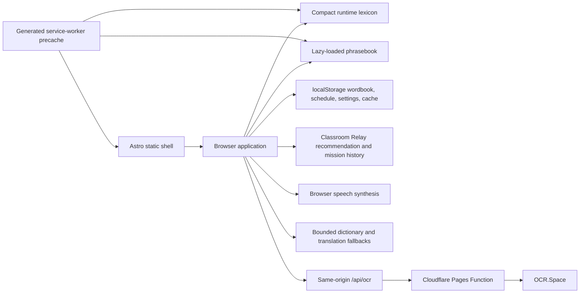

# Lucia's Dictionary

Lucia's Dictionary is a mobile-first, local-first English classroom learning tool for Chinese-speaking families. It turns an English or Chinese classroom sentence into readable, speakable, saveable word cards and schedules saved words for review.

## Learning loop

1. Enter or photograph a classroom sentence.
2. Translate Chinese input locally when a known phrase matches, with a bounded online fallback when needed.
3. Split the English sentence into child-friendly word cards with meanings, phonetics, learning bands, and speech.
4. Turn the real classroom sentence into a short Classroom Relay mission that explains which words deserve attention and why.
5. Practice selected words through listening, meaning recall, and a cloze inside the original sentence.
6. Save encounters and results to the browser-only wordbook and review due words with **会 / 不确定 / 忘记** feedback.
7. Finish with one simple parent-child prompt that carries the classroom sentence into home practice.

No account is required. Wordbook, review history, preferences, and lookup caches remain in the current browser.

## Classroom Relay

Classroom Relay turns a sentence a child actually encountered at school into a private, explainable micro-lesson. Its local recommendation engine ranks candidate words using the current wordbook, due dates, the last **know / unsure / forgot** result, mastery level, learning band, and repeated classroom encounters. Each recommendation includes a visible reason instead of presenting personalization as a black box.

A mission selects up to five words and rotates through three exercise types:

1. Listen and identify the word.
2. Match a Chinese meaning to the English word.
3. Put the word back into the original classroom sentence.

Completing a mission updates the existing spaced-review schedule, records the source sentence for each selected word, stores a bounded local mission history, and produces a parent handoff card. Mission content and learning history stay in `localStorage`; the feature adds no account, child profile, analytics event, or new network request.

## OpenAI Build Week 2026 extension

Lucia's Dictionary existed before the July 13, 2026 submission period. The pre-existing project already supported sentence input, OCR, local word cards, pronunciation, a wordbook, basic spaced review, and quizzes. Work added during Build Week is intentionally separated here for judging:

- the Classroom Relay mission model and bounded local mission history;
- an explainable word-priority engine based on actual review state;
- listening, meaning, and original-sentence cloze mission stages;
- multi-sentence classroom encounter memory for each learned word;
- a completion summary and immediate parent-child practice prompt;
- unit and mobile end-to-end coverage for the new learning loop.

This extension was designed and implemented through the current Codex Build Week task. Before Devpost submission, retrieve the task's `/feedback` Session ID and add it to the submission form alongside the dated commit history.

## Architecture



The interface binds immediately; dictionary data loads asynchronously and the phrasebook loads only when Chinese input needs it. The production service worker precaches the generated Astro JS/CSS and the local learning data, so the core English sentence flow works after installation without a network connection.

## Lookup order

1. Compact runtime core lexicon: `public/assets/lexicon/core-lexicon.json`
2. Legacy local dictionary: `public/assets/dict.json`
3. `dictionaryapi.dev`, followed by a translation fallback for the returned definition

The source lexicon and retired comparison datasets live under `tools/lexicon-data/`; they are build inputs and are not published. Runtime entries include normalized forms and one of three learning bands: `foundation`, `developing`, or `expanding`.

Chinese classroom phrases are matched against `public/assets/phrasebook.json` before any online translation request.

## OCR and network security

The browser compresses an uploaded image and sends it to the same-origin `POST /api/ocr` endpoint. `functions/api/ocr.js` is the single supported deployment entry point. The shared handler:

- keeps `OCR_SPACE_API_KEY` server-side;
- rejects cross-site, non-multipart, oversized, unsupported, and signature-mismatched uploads;
- applies the Cloudflare `OCR_RATE_LIMITER` binding (12 requests per client per minute);
- aborts a slow upstream request after 15 seconds;
- returns stable, non-sensitive errors and structured request logs;
- never stores or logs image contents, recognized text, or the API key.

Dictionary, translation, and OCR requests share bounded timeout, abort, and retry behavior. The service worker never caches `/api/*` responses.

## Technology

- Astro 7 static output and Vite
- JavaScript, Astro, and CSS
- Cloudflare Pages Functions and Rate Limiting bindings
- localStorage for user-owned local data
- Service Worker/Cache API for offline use
- Web Speech API for pronunciation and follow-along reading
- Vitest, Cloudflare Workers Vitest pool, and Playwright

Node.js 22.12 or newer is required; `.node-version` records the CI baseline.

## Project structure

```text
src/
  layouts/                 shared document layout and metadata
  pages/                   static pages and application shell
  scripts/                 application features, Classroom Relay, and unit tests
  styles/                  mobile-first design system
public/
  assets/                  runtime dictionary, phonetics, phrasebook, and images
  sw.js                    service-worker source with build placeholders
functions/
  api/ocr.js               Pages Function route
  _shared/ocr-handler.js   validated OCR proxy implementation
tools/
  lexicon-data/            non-published source and legacy datasets
  build-*.mjs              deterministic data/offline builders
  audit-*.mjs              release quality gates
tests/e2e/                 mobile Chromium user-flow tests
wrangler.jsonc             reproducible Pages/observability/rate-limit config
```

## Local development

```bash
npm ci
npm run dev
```

Build and preview the static production output:

```bash
npm run build
npm run preview
```

To exercise Pages Functions locally, copy `.dev.vars.example` to `.dev.vars`, set a non-production OCR key, then run:

```bash
npm run dev:pages
```

Never commit `.dev.vars`. Production secrets are set through the Cloudflare project, for example:

```bash
npx wrangler pages secret put OCR_SPACE_API_KEY --project-name luciadictionary
```

## Data maintenance

`tools/lexicon-data/core-lexicon.source.json` is the canonical rich source. Generate the compact public dataset and run its quality checks with:

```bash
npm run build:runtime-lexicon
npm run audit:lexicon
npm run audit:translation-quality
```

Translation audit exceptions must be explicit in `tools/translation-quality-allowlist.json`; deliberate corrections belong in `tools/translation-overrides.json`. The audit exits non-zero on a new suspicious value.

## Validation and CI

The complete local release gate is:

```bash
npm run verify
```

It checks formatting and Astro types, runs unit tests, executes the OCR handler inside the Cloudflare runtime, runs mobile Chromium end-to-end/offline tests, rebuilds the site and generated service worker, audits lexicon/SEO/OCR coverage/translation/offline artifacts, checks generated Cloudflare binding types, compiles Pages Functions, and fails on moderate-or-higher dependency advisories.

GitHub Actions runs the same gate on pushes to `main` and pull requests. Dependabot checks npm and GitHub Actions updates weekly.

Useful focused commands:

```bash
npm run test:unit
npm run test:worker
npm run test:e2e
npm run audit:all
npm run cf:types:check
npm run cf:build
```

## Privacy boundaries

- Local input analysis, word cards, speech, saved words, review schedules, settings, and cached lookups stay in the browser.
- A missing Chinese phrase may be sent to Google Translate fallback.
- A missing English word may be sent to `dictionaryapi.dev`; an English definition may then use the translation fallback.
- A photo is sent only after the user selects it, through the same-origin Cloudflare endpoint to OCR.Space.
- Cloudflare serves the site and endpoint and records bounded operational metadata; application logs intentionally exclude learning content.

See the in-app Privacy and Accessibility pages for user-facing details. Because this is designed for children to use with a parent, any future account, sync, analytics, or generated-content feature requires a separate privacy and content-safety review.

## Current limitations

- Local data does not sync across browsers or devices; JSON import/export is the recovery path.
- Public dictionary and translation services can be unavailable or change behavior; local coverage remains the primary experience.
- Browser voices and speech quality vary by device.
- OCR requires network access and a configured Cloudflare secret.
- Learning bands are broad product bands, not formal school-grade certifications.

The completed 2026 upgrade, measurements, acceptance gates, and next-stage options are tracked in [docs/optimization-upgrade-roadmap.md](docs/optimization-upgrade-roadmap.md).

## Author

Lucia's Dictionary was built by VeteranXYZ around Lucia's real classroom learning workflow.
