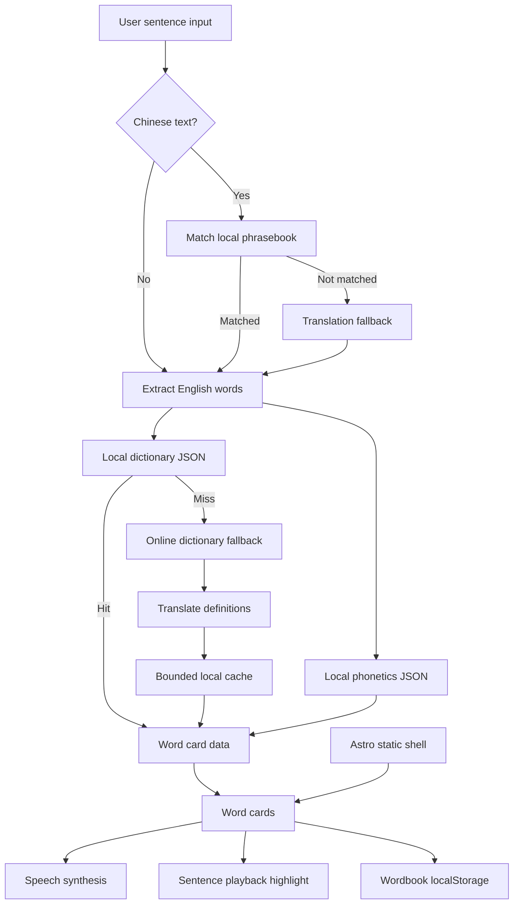

# Lucia's Dictionary

## Overview

Lucia's Dictionary is a mobile-first English sentence learning tool for Chinese-speaking families.

The app is built around a real homework workflow: a child receives an English classroom sentence, reading instruction, math prompt, or teacher note, and needs to understand the whole sentence quickly. The problem is not only "what does this word mean?" It is also "how do I read this sentence, which words should I remember, and how can I practice them later?"

Lucia's Dictionary turns that workflow into a small learning product:

- paste or type a Chinese or English sentence
- identify the English sentence to study
- split it into word cards
- show Chinese definitions and phonetics
- read words and full sentences aloud
- highlight words during sentence playback
- save unfamiliar words to a local wordbook
- review common classroom phrases

Technically, it is an Astro static app with a client-side JavaScript learning engine, local JSON dictionary assets, phrasebook data, phonetic data, browser speech synthesis, localStorage persistence, and online fallback paths for missing definitions or translation.

## Portfolio Summary

This project is best read as an AI-assisted frontend and product-building case study.

It began as an AI-generated single-file HTML prototype. That prototype established the rough idea and visual direction, but it was not a maintainable application. The project was then rebuilt into an Astro app and expanded through multiple product, data, interaction, reliability, and mobile-polish passes.

The portfolio value is in the evolution:

- an AI-generated HTML prototype became a structured Astro application
- a simple dictionary idea became a sentence-first learning workflow
- static page content became local JSON learning data
- lookup behavior was hardened with local-first data, online fallbacks, bounded cache, and async safeguards
- mobile interaction, speech, wordbook persistence, phrasebook study, settings, and branding were iterated into a complete tool

The main skill demonstrated here is not prompting AI to generate a page. It is repeatedly turning AI output into a coherent, testable, maintainable product for a real user.

## Why This Exists

Traditional dictionaries are usually word-first. Lucia's homework problem was sentence-first.

For a young learner, a classroom instruction such as "Circle the correct answer and explain your thinking" is not just a vocabulary problem. The child needs to hear the sentence, see it broken into understandable parts, identify unknown words, and return to those words later.

Lucia's Dictionary focuses on that learning loop instead of trying to become a general dictionary:

- understand the sentence
- learn the words inside it
- hear pronunciation repeatedly
- save unfamiliar words
- revisit classroom phrases

The product is intentionally local-first and low-friction. It should still be useful when network fallbacks are slow, unavailable, or inconsistent.

## Architecture



## Product Decisions

- Sentence-first, not search-first: the core unit is the homework sentence, because that is how the child meets the problem.
- Local dictionary first: the app ships with roughly 8,600 common English entries so common lookups do not depend on network calls.
- Known classroom phrases first: Chinese input checks local phrasebook data before trying online translation.
- Speech as a learning primitive: word reading, repeat count, speed control, and sentence playback are central, not decorative.
- Browser storage over accounts: the wordbook, settings, and cache stay in localStorage to keep the app simple and private.
- Mobile-first interaction: the interface is optimized for parent-child use on a phone, including bottom navigation, large touch targets, and safe-area handling.
- AI-assisted, human-directed: AI helped generate and iterate code, copy, layout, and debugging ideas, but the product scope, learning workflow, fallback rules, and acceptance decisions were human-led.

## Product Surface

The current app includes:

- Home input flow for Chinese or English sentences
- sentence analysis and English word extraction
- word cards with Chinese definitions, phonetics, favorite state, and speech controls
- full-sentence playback with word-card highlighting
- local wordbook stored in the browser
- phrasebook for common US elementary classroom instructions
- settings for speech speed, repeat count, and cache clearing
- mobile navigation across Home, Wordbook, Phrasebook, and Settings

Key data and assets:

- `public/assets/dict.json`: local dictionary entries
- `public/assets/phonetics.json`: local phonetic data
- `public/assets/phrasebook.json`: classroom phrase data
- `public/assets/lucia.png`, `monkey.png`, `logo.png`: app branding assets

## Key Features

### Sentence Analysis

Problem: A child often receives a full sentence, not an isolated word. Starting with a blank dictionary search box adds friction.

Decision: Make the input sentence the center of the workflow.

Implementation: The app extracts English words from the input, deduplicates them, and turns them into learning cards. If the input is Chinese, the app first checks the local phrasebook and then falls back to translation when needed.

### Local-First Dictionary Lookup

Problem: Network lookups can be slow, unreliable, or too inconsistent for a child-facing learning flow.

Decision: Prefer local data for common words and use online sources only as a fallback.

Implementation: The app checks `dict.json` first, uses local phonetic data when available, and only calls public dictionary/translation fallbacks for missing entries. Online results are cached locally with bounds and expiry behavior.

### Speech and Follow-Along Reading

Problem: For early English learners, pronunciation is as important as meaning.

Decision: Treat speech as part of the core learning loop.

Implementation: Browser `SpeechSynthesisUtterance` powers word reading and sentence playback. Settings allow speech speed and repeat count control, while sentence playback highlights the current word card to connect sound, text, and meaning.

### Wordbook

Problem: Words checked once are easy to forget.

Decision: Let the child or parent save unfamiliar words immediately.

Implementation: Favorite words are stored in localStorage and shown in a dedicated Wordbook view for later reading and review.

### Classroom Phrasebook

Problem: Many school tasks use repeated instruction patterns that are more useful as phrases than as isolated vocabulary.

Decision: Include a local classroom phrase library.

Implementation: The phrasebook covers common reading, writing, math, science, homework, and classroom behavior instructions. It also improves Chinese input handling by matching known phrases before falling back to online translation.

### Mobile-First Product Polish

Problem: The app is likely to be used by a parent and child together on a phone.

Decision: Optimize layout and interaction for mobile use rather than treating mobile as a smaller desktop.

Implementation: The UI uses bottom navigation, card-based learning blocks, larger touch targets, safe-area spacing, scroll-aware navigation behavior, and compact settings.

## Development Approach

Lucia's Dictionary was developed through iterative AI-assisted work, not a single prompt.

The project path:

1. Start from an AI-generated single-file HTML prototype.
2. Rebuild the base application in Astro with separated page structure, styles, and client-side behavior.
3. Add phonetics, Chinese input handling, and sentence-level analysis.
4. Add local learning resources, including classroom phrase data.
5. Harden dictionary lookup, cache behavior, network fallback, and async state handling.
6. Improve mobile layout, bottom navigation, visual branding, favicon, metadata, and production polish.
7. Rewrite the README as a portfolio artifact explaining both the product and the AI-assisted development process.

AI was useful for:

- decomposing the broad idea into buildable slices
- drafting Astro, JavaScript, and CSS implementations
- proposing copy and child-friendly UI states
- finding edge cases around async lookup, cache growth, and network failure
- iterating mobile layout and interaction details

Human judgment remained responsible for:

- defining the real learning problem
- choosing sentence-first behavior over a generic word-search tool
- deciding local-first fallback rules
- validating generated behavior in the running app
- rejecting changes that made the flow less clear or less child-friendly
- shaping the product into a small complete workflow rather than a feature pile

## Engineering Notes

### Stack

- Framework: Astro static site
- Language: JavaScript, Astro, CSS
- Data: JSON assets in `public/assets`
- Storage: `localStorage` for wordbook, settings, and cache
- Speech: browser `SpeechSynthesisUtterance`
- Dictionary fallback: `dictionaryapi.dev`
- Translation fallback: Google Translate public endpoint and browser Translator API when available
- Build: Vite through Astro

### Project Structure

```text
src/
  layouts/
    MainLayout.astro
  pages/
    index.astro
  scripts/
    app.js
  styles/
    global.css

public/
  assets/
    dict.json
    phonetics.json
    phrasebook.json
    logo.png
    lucia.png
    monkey.png
```

### Key Files

- `src/pages/index.astro`: application shell and page structure
- `src/scripts/app.js`: dictionary lookup, translation fallback, cache, speech, wordbook, settings, and UI interactions
- `src/styles/global.css`: mobile-first visual system and responsive layout
- `public/assets/dict.json`: local dictionary data
- `public/assets/phrasebook.json`: local classroom phrase data
- `public/assets/phonetics.json`: local phonetic data

### Validation

Current project check:

```bash
npm run build
```

Manual validation used for the current flow:

- enter an English classroom sentence
- generate word cards
- trigger pronunciation
- play the full sentence
- save a word to the wordbook
- navigate between Home, Wordbook, Phrasebook, and Settings
- build production assets

## Running Locally

Install dependencies:

```bash
npm install
```

Start the development server:

```bash
npm run dev
```

Build for production:

```bash
npm run build
```

Preview the production build:

```bash
npm run preview
```

## Limitations

This is not yet a runtime AI learning application. AI was used in development, but the app does not currently call an LLM to generate child-friendly explanations or adaptive lessons.

Current limitations:

- no backend account system; wordbook data only lives in the current browser through localStorage
- online dictionary and translation fallbacks depend on public endpoints that may fail or change behavior
- online definitions are not yet controlled by grade level
- no formal test suite yet for lookup, cache, wordbook, or phrase matching logic
- speech quality varies by browser, operating system, and installed voices
- no learning progress model, mastery state, review history, or spaced repetition

## Future Work

The strongest next step is a small model-backed explanation layer that stays child-friendly and bounded by the learning context.

Possible directions:

- OpenAI-powered short definitions written for elementary learners
- grade-level example sentences
- review mode with "know / unsure / forgot" feedback
- spaced repetition for saved words
- spelling practice and listening dictation
- module split for `dictionary`, `speech`, `cache`, `wordbook`, and `phrasebook`
- unit tests for morphology lookup, Chinese fallback, cache expiry, and wordbook persistence
- export/import or lightweight sync so a parent can preserve the child's wordbook across devices
- accessibility review for keyboard navigation, reduced motion, and screen reader labels

## Author

Lucia's Dictionary was built by VeteranXYZ around Lucia's real classroom learning workflow.
