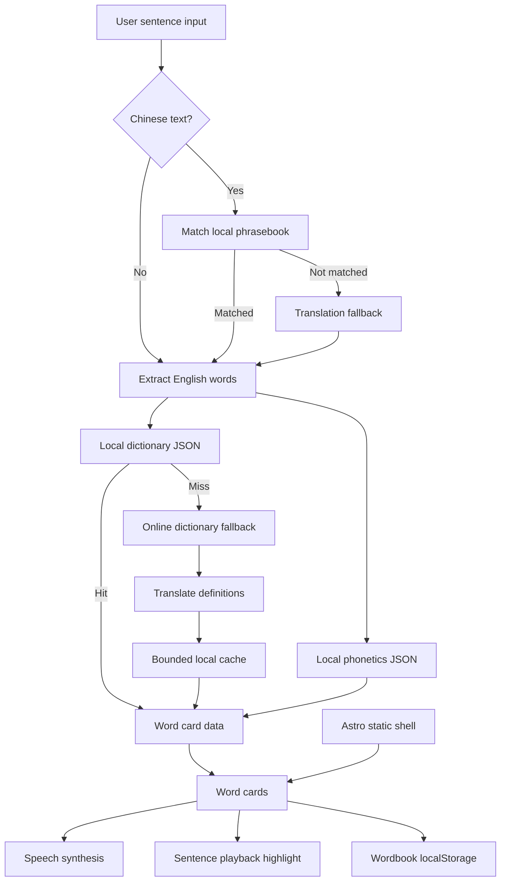

# Lucia's Dictionary

Lucia's Dictionary is a mobile-first English sentence learning tool for Chinese-speaking families.

It is built around a simple homework problem: a child receives an English classroom sentence, reading instruction, math prompt, or teacher note, and needs to understand the whole sentence quickly. The app helps turn that sentence into readable, speakable, reviewable word cards.

## What It Does

- accepts Chinese or English sentence input
- matches known classroom phrases before using online translation fallback
- extracts English words from the sentence
- generates word cards with Chinese definitions and phonetics
- reads individual words aloud
- reads the full sentence aloud with word-card highlighting
- saves unfamiliar words to a local wordbook
- provides a phrasebook of common US elementary classroom instructions
- supports photo OCR through a same-origin server endpoint when configured
- stores settings, cache, and wordbook data in the browser

## Why This Exists

Traditional dictionaries are usually word-first. Lucia's homework problem was sentence-first.

For a young learner, a sentence like "Circle the correct answer and explain your thinking" is not just a vocabulary lookup. The child needs to hear the sentence, see it broken into parts, identify unfamiliar words, and return to those words later.

Lucia's Dictionary focuses on that learning loop:

1. Start with the sentence.
2. Break it into words.
3. Show simple Chinese meanings and phonetics.
4. Practice pronunciation.
5. Save words that need review.

The app is intentionally local-first and low-friction. Common words and classroom phrases should work without relying on network calls, while online services remain available as a fallback for missing data.

## How It Works



## Features

### Sentence Input

The main input accepts either English or Chinese. English input is analyzed directly. Chinese input first checks the local classroom phrasebook, then falls back to translation when no local match is found.

### Word Cards

The app extracts English words, removes duplicates, and renders each word as a card with definition, phonetics, speech controls, and a save button.

### Local-First Dictionary

The app ships with roughly 8,600 local English entries in `public/assets/dict.json`, plus phonetic data in `public/assets/phonetics.json`. Local data is used first to reduce network dependency and keep common lookups fast.

### Online Fallbacks

When a word is missing locally, the app can use `dictionaryapi.dev` and translation fallback paths. Results are cached in localStorage with bounded cache behavior so repeated lookups are faster and storage does not grow without control.

### Speech and Follow-Along Reading

Word reading and full-sentence playback use the browser `SpeechSynthesisUtterance` API. During sentence playback, the current word card is highlighted so the child can connect sound, spelling, and meaning.

### Wordbook

Saved words are stored locally in the browser. The Wordbook view lets the child or parent return to unfamiliar words for later reading and review.

### Phrasebook

The phrasebook contains common US elementary classroom instructions and classmate language across homework, reading, writing, math, science, notices, art, PE, safety, and parent-signature workflows. It also improves Chinese input handling by matching known phrases before online translation.

### OCR Photo Input

The browser compresses uploaded classroom photos locally and sends the image to a same-origin `/api/ocr` endpoint. The OCR.Space API key is not exposed to the browser. Cloudflare Pages Functions can serve `functions/api/ocr.js`; the same handler is also available as `workers/ocr-worker.js` for a standalone Worker route.

### Mobile Layout

The interface is designed for phone use: bottom navigation, card-based layout, large touch targets, compact controls, and safe-area spacing.

## Product Decisions

- Sentence-first instead of search-first: the sentence is the learning unit because that is how homework arrives.
- Local-first instead of API-first: common words and classroom phrases should work even when the network is slow or unavailable.
- Browser storage instead of accounts: wordbook, settings, and cache stay private and local.
- Speech as core behavior: pronunciation and follow-along reading are part of the learning flow, not extra decoration.
- Mobile-first interface: the expected use case is a parent and child working together on a phone.

## Data and Privacy Model

- Public offline core: the static app shell, basic dictionary, phonetics, core images, and public phrasebook are intended to be available locally and may be cached by the service worker.
- Protected cloud layer: `OCR_SPACE_API_KEY` must stay server-side in Cloudflare Pages/Workers secrets. Future advanced phrasebook data or AI explanations should also live behind protected cloud endpoints.
- User data: the wordbook, settings, and lookup caches remain in the current browser through `localStorage` unless a future sync feature is explicitly added.
- OCR: uploaded images are sent only to the same-origin `/api/ocr` endpoint, which forwards them to OCR.Space with the server-side secret. OCR responses are not cached by the service worker.

## Development Notes

The first prototype was generated as a single HTML file with AI. The current version was rebuilt as an Astro app and refined around Lucia's real homework workflow.

Major development passes included:

- rebuilding the base app in Astro
- separating page structure, styles, and client-side behavior
- adding phonetics and Chinese input handling
- adding local dictionary and classroom phrase data
- hardening lookup, cache, fallback, and async behavior
- improving mobile layout, bottom navigation, branding, favicon, and metadata

AI was used during development for implementation drafts, copy alternatives, debugging ideas, and iteration support. The final behavior, learning flow, fallback rules, and product decisions were reviewed and directed manually.

## Tech Stack

- Framework: Astro static site
- Language: JavaScript, Astro, CSS
- Data: JSON assets in `public/assets`
- Storage: `localStorage` for wordbook, settings, and cache
- Speech: browser `SpeechSynthesisUtterance`
- Dictionary fallback: `dictionaryapi.dev`
- Translation fallback: Google Translate public endpoint and browser Translator API when available
- OCR endpoint: Cloudflare Pages Function or Worker reading `OCR_SPACE_API_KEY` from server-side secrets
- Build: Vite through Astro

## Project Structure

```text
src/
  layouts/
    MainLayout.astro
  pages/
    index.astro
  scripts/
    app.js
  styles/
    global.css

public/
  assets/
    dict.json
    phonetics.json
    phrasebook.json
    logo.png
    lucia.png
    monkey.png

functions/
  api/
    ocr.js

workers/
  ocr-handler.js
  ocr-worker.js
```

## Key Files

- `src/pages/index.astro`: application shell and page structure
- `src/scripts/app.js`: dictionary lookup, translation fallback, cache, speech, wordbook, settings, and UI interactions
- `src/styles/global.css`: mobile-first visual system and responsive layout
- `public/assets/dict.json`: local dictionary data
- `public/assets/phrasebook.json`: local classroom phrase data
- `public/assets/phonetics.json`: local phonetic data
- `functions/api/ocr.js`: Cloudflare Pages Function endpoint for same-origin OCR
- `workers/ocr-worker.js`: standalone Cloudflare Worker entry for `/api/ocr`
- `public/sw.js`: local-first service worker cache for public app core only

## OCR Deployment

For Cloudflare Pages, add a secret named `OCR_SPACE_API_KEY` in the Pages project settings. The `functions/api/ocr.js` endpoint will receive `POST /api/ocr`, validate `jpeg`, `png`, and `webp` uploads, reject oversized files, call OCR.Space with the server-side secret, and return only `{ "text": "..." }` or a stable error code.

For a standalone Worker, deploy `workers/ocr-worker.js` and route it to the same site path `/api/ocr`. Bind the same secret name:

```bash
wrangler secret put OCR_SPACE_API_KEY
```

The frontend never reads `PUBLIC_OCR_SPACE_KEY` and does not include OCR credentials in the browser bundle.

## Running Locally

```bash
npm install
npm run dev
```

Build and preview:

```bash
npm run build
npm run preview
```

## Validation

Current project check:

```bash
npm run check
npm test
npm run build
```

Manual validation used for the current flow:

- enter an English classroom sentence
- generate word cards
- trigger word pronunciation
- play the full sentence
- save a word to the wordbook
- navigate between Home, Wordbook, Phrasebook, and Settings

## Limitations

- No backend account system; wordbook data only lives in the current browser through localStorage.
- Online dictionary and translation fallbacks depend on public endpoints that may fail or change behavior.
- Online definitions are not yet controlled by grade level.
- Speech quality varies by browser, operating system, and installed voices.
- The app does not yet track mastery, review history, or spaced repetition.
- AI was used during development, but the app does not currently call an LLM at runtime.
- OCR requires network access and a deployed same-origin Cloudflare endpoint with `OCR_SPACE_API_KEY`.

## Future Work

- Add child-friendly model-backed explanations for difficult words.
- Add grade-level example sentences.
- Add review feedback such as "know", "unsure", and "forgot".
- Add spaced repetition for saved words.
- Add spelling practice and listening dictation.
- Split `src/scripts/app.js` into smaller modules such as `dictionary`, `speech`, `cache`, `wordbook`, and `phrasebook`.
- Add unit tests for morphology lookup, Chinese fallback, cache expiry, and wordbook persistence.
- Add export/import or lightweight sync so a parent can preserve the child's wordbook across devices.
- Review accessibility for keyboard navigation, reduced motion, and screen reader labels.

## Author

Lucia's Dictionary was built by VeteranXYZ around Lucia's real classroom learning workflow.
