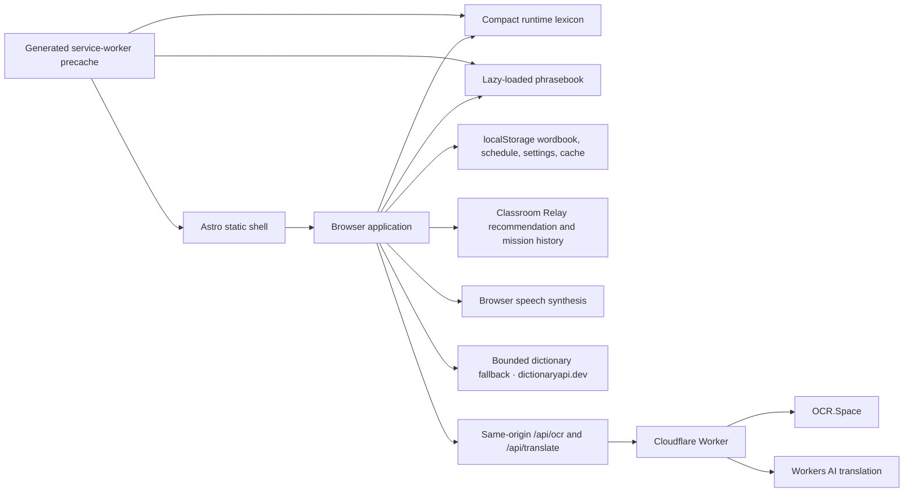

# Lucia's Dictionary

Lucia's Dictionary is a mobile-first, local-first English classroom learning tool for Chinese-speaking families. It turns an English or Chinese classroom sentence into readable, speakable, saveable word cards and schedules saved words for review.

## Learning loop

1. Enter or photograph a classroom sentence.
2. Translate Chinese input locally when a stored classroom phrase covers it almost entirely, with a bounded same-origin fallback when needed. The English shown always states where it came from.
3. Split the English sentence into child-friendly word cards with meanings, phonetics, learning bands, and speech.
4. Turn the real classroom sentence into a short Classroom Relay mission that explains which words deserve attention and why.
5. Practice selected words through listening, meaning recall, and a cloze inside the original sentence.
6. Save encounters and results to the browser-only wordbook and review due words with **会 / 不确定 / 忘记** feedback.
7. Finish with one simple parent-child prompt that carries the classroom sentence into home practice.

No account is required. Wordbook, review history, preferences, and lookup caches remain in the current browser.

## Classroom Relay

Classroom Relay turns a sentence a child actually encountered at school into a private, explainable micro-lesson. Its local recommendation engine ranks candidate words using the current wordbook, due dates, the last **know / unsure / forgot** result, mastery level, learning band, and repeated classroom encounters. Each recommendation includes a visible reason instead of presenting personalization as a black box.

A mission selects up to five words and rotates through three exercise types:

1. Listen and identify the word.
2. Match a Chinese meaning to the English word.
3. Put the word back into the original classroom sentence.

Completing a mission updates the existing spaced-review schedule, records the source sentence for each selected word, stores a bounded local mission history, and produces a parent handoff card. Mission content and learning history stay in `localStorage`; the feature adds no account, child profile, analytics event, or new network request.

## Classroom Relay provenance

Classroom Relay was added on top of a project that already supported sentence input, OCR, local word cards, pronunciation, a wordbook, spaced review, and quizzes. It was designed and implemented with AI assistance, with dated commit history retained. The product decisions stayed human-directed: the app does not generate homework answers, create child accounts, or upload learning history, and its recommendation and practice loop is local, deterministic, and explainable to parents.

## Architecture


```mermaid
flowchart LR
  A["Astro static shell"] --> B["Browser application"]
  B --> C["Compact runtime lexicon"]
  B --> D["Lazy-loaded phrasebook"]
  B --> E["localStorage wordbook, schedule, settings, cache"]
  B --> L["Classroom Relay recommendation and mission history"]
  B --> F["Browser speech synthesis"]
  B --> G["Bounded dictionary fallback · dictionaryapi.dev"]
  B --> H["Same-origin /api/ocr and /api/translate"]
  H --> I["Cloudflare Worker"]
  I --> J["OCR.Space"]
  I --> M["Workers AI translation"]
  K["Generated service-worker precache"] --> A
  K --> C
  K --> D
```

The interface binds immediately; dictionary data starts during the browser's first idle window or immediately on user interaction, and the phrasebook loads only when Chinese input needs it. The production service worker precaches the generated Astro JS/CSS and the local learning data, so the core English sentence flow works after installation without a network connection.

## Lookup order

1. Runtime phrase lexicon: `public/assets/lexicon/phrase-lexicon.json` — multi-word classroom phrases such as `show your work` resolve as one card instead of being split
2. Compact runtime core lexicon: `public/assets/lexicon/core-lexicon.json` (eager head) and `core-lexicon-extended.json` (deferred long tail)
3. Legacy local dictionary: `public/assets/dict.json`
4. `dictionaryapi.dev`, followed by a translation fallback for the returned definition

The runtime core lexicon ships as two shards. The head carries every `foundation` and `developing` word and is precached at install; the long tail is fetched after first paint and is only awaited when a sentence actually contains a word the head cannot resolve.

The source lexicon and retired comparison datasets live under `tools/lexicon-data/`; they are build inputs and are not published. Runtime entries include normalized forms and one of three learning bands: `foundation`, `developing`, or `expanding`.

Chinese classroom phrases are matched against `public/assets/phrasebook.json` before any online translation request.

## OCR and network security

The browser compresses an uploaded image and sends it to the same-origin `POST /api/ocr` endpoint. `worker/index.js` is the single production deployment entry point and delegates to the shared handler, which:

- keeps `OCR_SPACE_API_KEY` server-side;
- rejects cross-site, non-multipart, oversized, unsupported, and signature-mismatched uploads;
- applies layered Cloudflare limits per network (30/minute), globally (300/minute per location), and per client (12/minute), failing closed if any binding is unavailable;
- aborts a slow upstream request after 15 seconds;
- stops reading upstream responses after 256 KiB even when the provider omits `Content-Length`;
- returns stable, non-sensitive errors and structured request logs;
- never stores or logs image contents, recognized text, or the API key.

`POST /api/translate` is the same-origin translation route. It applies the same shape of protection: cross-site rejection, JSON-only bodies bounded at 4 KiB, a 600-character input cap, an allow-list of the `en` / `zh-CN` pair, per-network (40/minute) and global (400/minute) rate limits that fail closed, and a 12-second upstream abort. It logs only sizes and durations, never the sentence or its translation.

Dictionary, translation, and OCR requests share bounded timeout, abort, and retry behavior. The service worker never caches `/api/*` responses. The published CSP allows no inline script: `tools/build-security-headers.mjs` hashes the JSON-LD blocks at build time and `npm run audit:seo` fails if `'unsafe-inline'` reappears.

## Technology

- Astro 7 static output and Vite
- JavaScript, Astro, and CSS
- Cloudflare Worker Static Assets and Rate Limiting bindings
- localStorage for user-owned local data
- Service Worker/Cache API for offline use
- Web Speech API for pronunciation and follow-along reading
- Vitest, Cloudflare Workers Vitest pool, and Playwright

Node.js 22.12 or newer is required; `.node-version` records the CI baseline.

## Project structure

```text
src/
  components/app/          independent Home, Wordbook, Quiz, Templates, and Settings panels
  layouts/                 shared document layout and metadata
  pages/                   thin static route composition
  scripts/app-state.js     subscribable wordbook and settings snapshot
  scripts/controllers/     page-level navigation, mission, settings, and wordbook controllers
  scripts/                 local learning features and unit tests
  styles/                  mobile-first design system
public/
  assets/                  runtime dictionary shards, phonetics, phrasebook, and images
  _headers                 security-header template with a CSP hash placeholder
  sw.js                    service-worker source with build placeholders
worker/
  index.js                 production Worker and its /api routes
  lib/ocr-handler.js       validated OCR proxy implementation
  lib/translate-handler.js same-origin translation proxy over Workers AI
  lib/security-headers.js  API response hardening
tools/
  lexicon-data/            non-published source datasets
  build-*.mjs              deterministic data/offline/header builders
  audit-*.mjs              release quality gates
tests/e2e/                 mobile Chromium user-flow tests
wrangler.jsonc             reproducible Worker assets/observability/rate-limit config
```

## Local development

```bash
npm ci
npm run dev
```

Build and preview the static production output:

```bash
npm run build
npm run preview
```

To exercise the production Worker route locally, copy `.dev.vars.example` to `.dev.vars`, set a non-production OCR key, then run:

```bash
npm run dev:cloudflare
```

Never commit `.dev.vars`. Production secrets are set through the Cloudflare project, for example:

```bash
npx wrangler secret put OCR_SPACE_API_KEY
```

`/api/translate` uses the Workers AI binding declared in `wrangler.jsonc`; Workers AI must be enabled for the account before translation works in production.

## Data maintenance

`tools/lexicon-data/core-lexicon.source.json` is the canonical rich source. Generate the compact public dataset and run its quality checks with:

```bash
npm run build:runtime-lexicon
npm run build:phrase-lexicon
npm run audit:lexicon
npm run audit:translation-quality
```

`build:runtime-lexicon` emits both core-lexicon shards; `build:phrase-lexicon` emits the multi-word runtime phrase layer, skipping source phrases that still lack a real Chinese meaning and reporting how many were skipped.

Translation audit exceptions must be explicit in `tools/translation-quality-allowlist.json`; deliberate corrections belong in `tools/translation-overrides.json`. The audit exits non-zero on a new suspicious value.

## Validation and CI

The complete local release gate is:

```bash
npm run verify
```

It checks formatting and Astro types, runs unit tests, executes the API handlers inside the Cloudflare runtime, runs mobile Chromium end-to-end/offline tests, rebuilds the site plus the generated service worker and CSP headers, audits lexicon/SEO/OCR coverage/translation/offline artifacts, checks generated Cloudflare binding types, and performs a Worker deployment dry run.

Dependency advisories run as a separate `npm run audit:deps` job. They are reported but do not fail the gate, because a new upstream advisory should not turn `main` red on its own.

GitHub Actions runs the same gate on pushes to `main` and pull requests. Dependabot checks npm updates monthly.

Useful focused commands:

```bash
npm run test:unit
npm run test:worker
npm run test:e2e
npm run audit:all
npm run cf:types:check
npm run cf:build
```

## Privacy boundaries

- Local input analysis, word cards, speech, saved words, review schedules, settings, and cached lookups stay in the browser.
- **Offline-only mode** in Settings stops every optional network call — online lookup, translation, and OCR — and the UI stops offering them.
- Translation never leaves the origin from the browser: text goes to the same-origin `POST /api/translate`, which calls Cloudflare Workers AI server-side. Chrome's on-device `Translator` is tried first and is bounded by a timeout so a model download can never stall the flow.
- A missing English word may be sent to `dictionaryapi.dev`; an English definition may then use the translation proxy.
- A photo is sent only after the user selects it, through the same-origin Cloudflare endpoint to OCR.Space.
- Cloudflare serves the site and endpoint and records bounded operational metadata; application logs intentionally exclude learning content.
- No client-side analytics service is loaded and no analytics Cookie is set.

See the in-app Privacy page and Guide, which includes accessibility notes, for user-facing details. Because this is designed for children to use with a parent, any future account, sync, analytics, or generated-content feature requires a separate privacy and content-safety review.

## Current limitations

- Local data does not sync across browsers or devices; JSON import/export is the recovery path.
- Public dictionary and translation services can be unavailable or change behavior; local coverage remains the primary experience.
- Browser voices and speech quality vary by device.
- OCR requires network access and a configured Cloudflare secret.
- Translation requires the Workers AI binding to be enabled for the Worker; without it `/api/translate` returns `service_unavailable` and the app degrades to local phrase matching.
- HEIC photos cannot be decoded by every browser; the app names the format and asks for a JPEG instead.
- Learning bands are broad product bands, not formal school-grade certifications.

The completed 2026 upgrade, measurements, acceptance gates, and next-stage options are tracked in [docs/optimization-upgrade-roadmap.md](docs/optimization-upgrade-roadmap.md).

## Author

Lucia's Dictionary was built by VeteranXYZ around Lucia's real classroom learning workflow.

## License

Licensed under the [Apache License 2.0](LICENSE).
