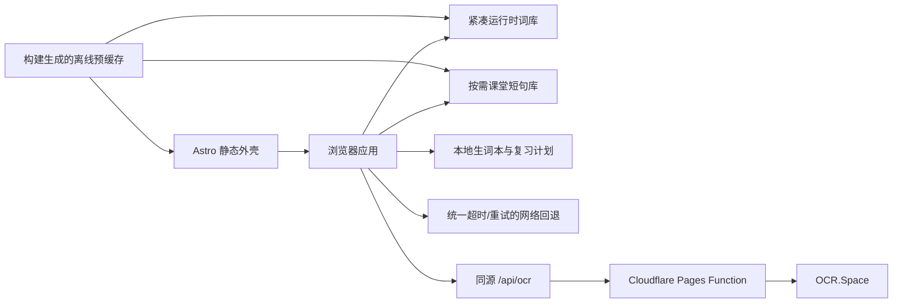

# Lucia's Dictionary 优化升级路线图

> 审核与升级日期：2026-07-12  
> 当前状态：v3.0.0 一次性升级已完成；完整本地发布门禁通过，尚未代替项目所有者执行生产部署。

## 1. 项目定位

Lucia's Dictionary 是面向华语家庭的小学课堂英语学习闭环，而不是传统的单词搜索框：句子输入或拍照后，应用生成单词卡、朗读、收藏，并根据学习反馈安排后续复习。

本轮升级保留了最有价值的架构约束：

- **句子优先**：作业和课堂指令以句子到达，单词卡是学习结果。
- **本地优先**：常用词、音标、课堂短句、生词本、复习历史与设置尽量在浏览器内完成。
- **手机优先**：主要使用场景是家长与孩子在手机上共同学习。
- **无账户负担**：当前不建立账户或同步后台，个人学习数据留在本地。
- **云能力最小化**：网络只用于本地缺失时的翻译、词典和用户主动触发的 OCR。

## 2. 初始审核基线

初始审核发现的主要风险如下：

| 优先级 | 问题                                                                                                             |
| ------ | ---------------------------------------------------------------------------------------------------------------- |
| P0     | Astro 依赖存在生产安全告警；仓库无 CI；OCR 匿名代理无应用限流、请求签名检查、超时或运行时测试                    |
| P1     | Service Worker 缓存目录错误且没有构建级 precache；全部 JSON 阻塞应用初始化；外部请求没有统一取消/超时策略        |
| P1     | 线上移动 Lighthouse Accessibility 86；页面禁止缩放、无 main landmark、动态结果与导航语义不完整、部分颜色对比不足 |
| P2     | 发布了重复/无效词库；10,574 项没有运行时学习分级；翻译审计有 35 个可疑项；文档、版本与实际查词链路漂移           |
| P2     | 生词本只有收藏，没有学习反馈、到期复习与掌握状态                                                                 |

初始代码基线为 15 个测试文件、85 项测试；静态构建可用，但没有浏览器端、离线端或 Cloudflare Runtime 质量门禁。

## 3. 已完成升级

### Phase 0：安全与可复现交付

- [x] 升级到 Astro 7.0.7、Node 22.12 基线、TypeScript 6、Vitest 4、Wrangler 4，并统一版本为 v3.0.0。
- [x] 增加 GitHub Actions 完整验证和每周 Dependabot 更新检查。
- [x] 新增 `wrangler.jsonc`、生成绑定类型、兼容日期、source maps、日志/trace observability 和生产 smart placement。
- [x] 确定 Cloudflare Pages Function 为唯一 OCR 部署入口，删除重复且未同等验证的独立 Worker。
- [x] OCR 增加同源检查、multipart 与 Content-Length 预检、实际文件大小/类型/魔数验证、15 秒上游超时、响应大小限制和稳定错误。
- [x] 增加每客户端每分钟 12 次的 Cloudflare Rate Limiting 绑定；日志不包含图片、识别文字或密钥。
- [x] 使用 Cloudflare Workers Vitest pool 在 workerd 中覆盖 6 个 OCR 安全与失败分支。
- [x] 生产依赖审计从初始 5 项告警降为 0。

### Phase 1：可靠性、离线与可访问性

- [x] 建立共享网络策略：AbortSignal、超时、有限重试、错误分类；应用于翻译、在线词典、静态资源和 OCR。
- [x] 改为 UI 先绑定，核心词典异步准备；课堂短句库只在首次中文输入时加载。
- [x] 从实际 Astro 构建产物生成 Service Worker precache 清单和内容哈希，原子清理旧版本 Lucia 缓存。
- [x] 增加离线构建审计与移动 Chromium 离线整页刷新测试；API 响应明确不缓存。
- [x] 增加 Playwright 关键路径：单词卡、生词本/复习/测验、导航语义、OCR、离线分析和隐私供应商说明。
- [x] 允许页面缩放，增加跳转主内容、main landmark、全局焦点、reduced motion、live status、tab 状态和页面标题焦点管理。
- [x] 调整文字与导航颜色对比，移除 Google Fonts 网络依赖并给图片补充尺寸/加载提示。
- [x] 补充缓存与安全响应头，更新隐私、无障碍、来源和 README 的真实数据流。

### Phase 2：词库、加载与数据质量

- [x] 将 2.52 MB 富源词库迁入 `tools/lexicon-data/`，生成 1.18 MB 紧凑运行时词库；gzip 从约 564 KB 降到 461 KB。
- [x] 将旧 core 和 phrase lexicon 从公开产物移除，避免发布重复/不可达数据。
- [x] 运行时词库继续保持 10,574 项、必需单词 88/88、必需短句 25/25、OCR 样本本地覆盖 100%。
- [x] 为每个运行时词条生成 `foundation`、`developing` 或 `expanding` 学习带，并在单词卡展示。
- [x] 建立翻译 override、allowlist 与阻断式质量审计，将可疑项从 35 降到 0。
- [x] 修复 overrides 读取继承属性的边界问题；移除没有进入产品流程的句子解释死代码。
- [x] 将版本号作为单一来源传入页面、缓存和 favicon，修正文档中的过期词库优先级与 Worker 说明。

### Phase 3：学习闭环

- [x] 生词本数据向后兼容地增加掌握状态、间隔天数、下次复习时间、上次结果和最多 20 条历史。
- [x] 增加“会 / 不确定 / 忘记”反馈与轻量间隔复习：掌握后逐步延长，忘记后 10 分钟再次到期。
- [x] 生词本显示收藏数、今日到期和已掌握数；朗读与测验优先使用到期词。
- [x] 测验使用可测试的 Fisher–Yates 洗牌，避免固定题序，并将答题结果写回复习计划。
- [x] JSON 导入保持旧数据兼容，导出包含新的复习状态，继续作为无账户场景下的备份通道。

## 4. 最终验收

### 自动化发布门禁

`npm run verify` 已完整通过：

| 门禁                       |                                           最终结果 |
| -------------------------- | -------------------------------------------------: |
| Prettier                   |                                           全部匹配 |
| Astro Check                |          62 files，0 errors / 0 warnings / 0 hints |
| Node/Vitest                |                          16 files，90 tests passed |
| Cloudflare workerd         |                             1 file，6 tests passed |
| Playwright mobile Chromium |                       5/5 passed，包含离线整页刷新 |
| Astro 生产构建             |                                      7 pages，成功 |
| SEO                        |                              6 sitemap URLs passed |
| 词库                       | 10,574 runtime entries；88/88 words；25/25 phrases |
| OCR 样本                   |              244 tokens，100% 本地覆盖，0 fallback |
| 翻译质量                   |                          0 suspicious translations |
| 离线产物                   |                   precache/hash/build audit passed |
| Cloudflare                 |    binding types current；Pages Functions compiled |
| 依赖安全                   |                                  0 vulnerabilities |

### 浏览器复测

| 指标                               |                                审核前线上版本 |                              v3.0.0 本地生产构建 |
| ---------------------------------- | --------------------------------------------: | -----------------------------------------------: |
| Lighthouse Accessibility（mobile） |                                            86 |                                          **100** |
| Lighthouse Best Practices          |                                           100 |                                          **100** |
| Lighthouse SEO                     |                                           100 |                                          **100** |
| Lighthouse failed audits           |                      颜色对比、main、viewport |                                            **0** |
| 冷启动 LCP / CLS                   |                       219 ms / 0.00（无节流） |            **337 ms / 0.00**（Slow 4G + 4× CPU） |
| 首次页面请求                       | 会加载 5 个 JSON、11 个字体片段及平台注入资源 | **12 个总请求**；无远程字体；phrasebook 延迟加载 |

本地实验室数据不等同于真实用户 p75；生产部署后仍应通过真实用户监控确认 LCP ≤ 2.5s、INP ≤ 200ms、CLS ≤ 0.1。

## 5. 下一阶段可选路线

本轮目标已经闭环。以下项目不应在没有产品与隐私决策时自动扩展：

1. **真实学习成效**：先观察到期复习完成率、忘记率和持续使用天数，再调整复习间隔。
2. **更细年级内容**：学习带目前是宽泛产品分级；正式按年级标注需要可靠来源与人工内容审核。
3. **拼写与听写模式**：可以完全本地实现，适合作为下一项低隐私成本能力。
4. **跨设备同步**：只有在 JSON 备份不足时再评估；账户、儿童数据、删除权和家长同意必须先设计。
5. **生成式解释**：只有在家长可见、输出可审核、成本有上限且失败可降级时考虑，不应直接进入儿童主流程。

## 6. 持续发布规则

- 每次变更都运行 `npm run verify`，不跳过浏览器离线测试或 Cloudflare Runtime 测试。
- 修改富源词库后必须重新生成 runtime lexicon，并让翻译质量与覆盖审计保持为阻断门禁。
- 修改 Astro 输出、资源目录或缓存策略后必须重新生成并审计 Service Worker。
- 不把公开回退 API 当作稳定合同；新网络能力必须有超时、取消、失败提示和本地降级。
- 新增账户、同步、分析或生成内容前，先完成儿童隐私与内容安全审阅。
